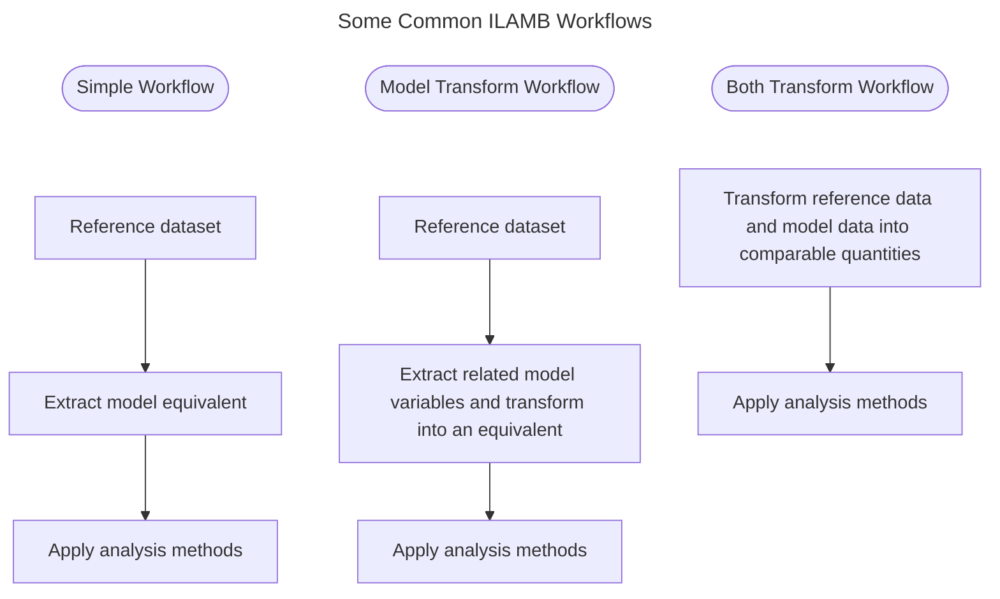

---
kernelspec:
  name: python3
  display_name: 'Python 3'
---

# Transforms

## Background

The `ilamb3` methodology focuses on making model-data intercomparisons and follows the rough flow labeled *Simple Workflow* in the following flowchart.



We use the reference data to extract a quantity from the model which matches in terms of the variable name as well as a space-time window over which the reference data is defined. For example, in the [quickstart](quickstart.md) tutorial we specified a dataset `WECANN-1-0/obs4MIPs_ColumbiaU_WECANN-1-0_mon_gpp_gn_v20260302.nc` and pointed `ilamb run` at some `CanESM5` model data. When the study was executed, `ilamb3` opened the reference datafile and found the `gpp` variable was defined from 2007-2015. We use this information and the model database to find the equivalent variable from `CanESM5` over the same time range and then pass these two sources into a series of analyses. This procedure works well as many quantities our community measures have direct analogs to model output. However this is not always the case.

Sometimes to find a comparable model output, we need to take *related* model variables and transform them into the desired quantity. This is represented as the flow labeled *Model Transform Workflow*. Consider the `permafrost/Brown2002/Brown2002.nc` dataset which estimates permafrost extent over high latitudes of the northern hemisphere. While it may be that certain models have an internal representation of permafrost extent, it is not a CMIP standard variable that is output. However, the literature has techniques for taking the layered soil temperatures (known in CMIP as `tsl`) and creating an estimate of permafrost extent. So in order to make a comparison to the Brown2002 data, we need to first *transform* the soil temperature data to permafrost extent and then the analysis can be performed.

More generically, there may be examples of where both the reference and comparison data need to be transformed before they may be considered comparable (*Both Transform Workflow* from the above flowchart). In `ilamb3` we have assumed that this is always the case and implement transforms in such as way that if no transformation is needed, it is harmlessly skipped.

## Getting Started

The main work of a implementing a transform in `ilamb3` is simple: write a function that takes in a dataset, operates on it if it can, and then returns a dataset. You could start your implementatoin by writing a simple function of the type:

```python
def my_transform_func(ds: xr.Dataset) -> xr.Dataset:
```

Your function should follow these guidelines:

- The function should never fail. Detect errors and simply return the dataset if some problem was encountered. Error handling will come later in the pipeline if the expected output is not in the dataset.
- If the dataset already has what you are trying to generate, just return the dataset. This is important because transforms will be applied uniformly to both reference and comparison (model) data.
- If the input dataset does not have the requisite data, just return the dataset. That is, if you were expecting `tsl` in the input dataset to estimate permafrost extent and it isn't in there, just return the dataset.

For example, a simple version of the above `tsl` to `permafrost_extent` example might look like:

```{code-cell} python
def permafrost_extent(ds: xr.Dataset) -> xr.Dataset:
    if "tsl" not in ds:
        return ds
    if "permafrost_extent" in ds:
        return ds
    temperature_threshold = 273.15  # [K]
    ds["permafrost_extent"] = (
        ds.groupby("time.year").max()["tsl"] < temperature_threshold
    ).any(dim="depth")
    return ds
```

This says that the permafrost extent is detected by when the maximum annual temperature is below freezing for any depth. Don't take that definition too seriously if you happen to be an expert and know better. We present this expression for its concision to aid in this tutorial.

## Integrating into `ilamb3`

If you have made it this far, you understand the lion's share of what makes up a transform. It is just a function that operates on datasets that then can be chained together in useful ways. There are a few system needs however that require transforms be slightly more complicated.

1. In order to determine what can be executed from the model output you give, `ilamb3` needs to know beforehand what data will be used. Our example transform would need to communicate that `tsl` is needed in order to execute.
2. In order to chain the transforms together, we need the functions to always take in a `Dataset` and return a `Dataset`. But this does not leave any room for parameters over which you might like to give users control. In the above example, we have `temperature_threshold=273.15` hardcoded. This is a reasonable default, but a researcher might want to lower it slightly and in the current setup they cannot do so without changing the source code.

To this end, transforms are not merely functions but an [abstract base class](https://docs.python.org/3/library/abc.html) (ABC) we call an [ILAMBTransform](https://github.com/rubisco-sfa/ilamb3/blob/b32815578969cc8d4c7f6a6f58b0beed3b2c6574/ilamb3/transform/base.py#L11). Lets change the function we wrote above into an `ILAMBTransform` and see how they work. If you are unfamiliar with classes in python, you may want to look over an introductory [tutorial](https://realpython.com/python-classes/).

```{code-cell} python
from ilamb3.transform.base import ILAMBTransform  # import the ABC from ilamb

class permafrost_extent(ILAMBTransform):  # define a class that inherits from the ABC

    def __call__(self, ds: xr.Dataset) -> xr.Dataset:  # the content from above
        if "tsl" not in ds:
            return ds
        if "permafrost_extent" in ds:
            return ds
        temperature_threshold = 273.15  # [K]
        ds["permafrost_extent"] = (
            ds.groupby("time.year").max()["tsl"] < temperature_threshold
        ).any(dim="depth")
        return ds
```

In words, the above code snippet imports the abstract base class from `ilamb3` and then creates a new class `permafrost_extent` that *inherits* from it. Then we create a member function named `__call__` and put the content from our function inside. Python has a number of *double under* or *dunder* methods that have special behavior. The `__call__` method will allow us to call an instance of the `permafrost_extent` class as if it were a function.

At the moment, it does not yet seem like we have accomplished much by this change. However, if you try to create an instance of this class we have built,

```python
my_transform = permafrost_extent()
```
you should see that python throws an error:
```
TypeError: Can't instantiate abstract class permafrost_extent without an implementation for abstract methods '__init__','required_variables'
```

The `ILAMBTransform` defines a template for all transform functions. If you don't implement all of the methods we need, you can't even create an instance. You will see that the error message is complaining about not having an implementation for two functions. The first of these is `__init__`. This is another special dunder method that in other languages is called the constructor. It is a function that executes when an instance of the class is made. Add the following member function to your class:

```python
class permafrost_extent(ILAMBTransform):
    def __init__(self, temperature_threshold: float = 273.15, **kwargs: Any):
        self.temperature_threshold = temperature_threshold
```

This method says that the transform can take in any number of keyword arguments and that they may be of any type, but it expects one called `temperature_threshold` and it has a default value of `273.15`. We will store this keyword value along with the instance of the class and use it in a moment. The second missing function is `required_variables`. The python language has a built-in help function that we can call on this method to see what it does:

```{code-cell} python
help(ILAMBTransform.required_variables)
```

From this help, we learn that `required_variables` is a function that returns a list of variables that the transform needs (if any) in the input `Dataset`. So we add another member function that returns `tsl` in a list.

```python
class permafrost_extent(ILAMBTransform):
    def required_variables(self):
        return ['tsl']
```

## Full Example Transform

Let's put all those pieces together now and show a full listing of what the transform looks like.

```{code-cell} python
from ilamb3.transform.base import ILAMBTransform
from typing import Any  # a type for our kwargs

class permafrost_extent(ILAMBTransform):
    def __init__(self, temperature_threshold: float = 273.15, **kwargs: Any):
        self.temperature_threshold = temperature_threshold

    def __call__(self, ds: xr.Dataset) -> xr.Dataset:
        if "tsl" not in ds:
            return ds
        if "permafrost_extent" in ds:
            return ds
        ds["permafrost_extent"] = (
            ds.groupby("time.year").max()["tsl"] < self.temperature_threshold  # uses the instance variable
        ).any(dim="depth")
        return ds

    def required_variables(self):
        return ["tsl"]
```

There are two small changes to note:

1. We have imported the `Any` type for use as a `kwargs` type descriptor. This is not strictly necesary, but it means that keyword arguments could be any type.
2. We removed the hard-coded `temperature_threshold=273.15` from the `__call__` method and used the value we stored in the contructor instead.

Now if you create an instance of your transform, you will no longer see any error message and are ready for testing.

## Testing the transform

```{code-cell} python
my_transform = permafrost_extent()
```
